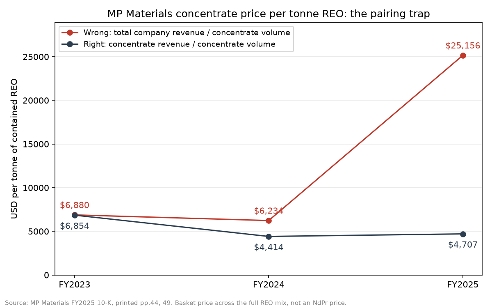

# rare-earth-intel

A small, auditable pipeline that reads a rare earth company's annual report, extracts the numbers
into a structured table where every number keeps its meaning, measures its own accuracy against
checked answers, and catches the mistakes that make naive price calculations wrong.

**Status:** v1 shipped 30 Sep 2026 — one company, one filing (MP Materials FY2025 10-K).
Started August 2026. Build log: [`notes/devlog.md`](notes/devlog.md).



## Why this exists

Numbers in company reports are easy to read and easy to misuse. A number only means something
together with its context: which part of the company, which product, which year, which unit, which
scale. Take it out of the PDF without that context and it becomes dangerous.

The chart above shows one example. MP Materials states a concentrate price of about $4,700 per
tonne of rare earth content. Divide *total company* revenue by concentrate volume instead, and you
get a price that is 0.4% too high in FY2023, 41% too high in FY2024, and **435% too high in FY2025**.
Nothing in the two numbers warns you: the mistake is invisible on older data and grows as the
business changes (MP began refining its own concentrate and selling magnet materials in 2025).

This is obvious to an expert who reads the right page, and invisible to a pipeline, a quick
spreadsheet estimate, or an AI tool that doesn't. The project is about making it impossible for a
machine to make it.

It is one of several traps in this single filing:

| Trap | Example |
|---|---|
| Wrong pairing | total revenue ÷ concentrate volume (the chart) |
| Tonnes that aren't physical tonnes | 8,922 t is contained rare earth content, not the weight shipped |
| A basket price that isn't an NdPr price | $4,707/t averages the full mix, about half of it low-value cerium |
| Two scales on one page | "in whole units" and "in thousands" on printed p.49 |
| Money that isn't revenue | Price Protection Agreement income ($51.0m) is booked outside revenue |
| Modelled volumes | NdPr sales tonnes convert metal to oxide at an assumed 1.20 ratio |
| Same label, different number | "NdPr oxide and metal" is $115.1m on p.44 but $9.3m (related-party) on p.105 |

## What it does

```
PDF ──► extract_rows.py ──► build_rows.py ──► score.py         (accuracy vs ground truth)
         read pages,          apply label map,  self_checker.py  (checks with no answer key)
         parse tables         28-column rows    chart.py         (the figure above)
```

1. **Extraction** — reads the report's tables line by line, tracking the scale header and section
   heading each number sits under, and keeps the exact printed text of every number.
2. **Meaning** — a small label map ([`config/mp_fy2025_label_map.csv`](config/mp_fy2025_label_map.csv))
   records what each line means: scope, segment, material, chain stage, basis, unit. Domain knowledge
   lives here as data, not buried in code.
3. **Traceability** — every row carries its page, printed page and `raw_text`.
4. **Measured accuracy** — output is scored field by field against a 20-row ground truth.
5. **Automatic checks** — raw text found on the cited page, values in plausible ranges, stated price
   reconciles with revenue ÷ volume, segment revenue bridges to the consolidated total.

**Rule:** no language model does arithmetic over retrieved text. Numbers go into the table; the
only division happens in code.

## Results

| Measure | Result |
|---|---|
| Ground-truth rows found | 18 of 20 (the 2 missing are on a page the parser does not read yet) |
| Field accuracy on found rows | 13 of 13 fields correct on all 18 rows |
| Automatic checks | 64 of 64 pass |
| Price reconciliation | revenue ÷ volume matches stated price within 0.01% for FY2023–FY2025 |
| Revenue bridge | 160,369 + 66,861 − 2,789 = 224,441 ($k), exact |

**Read these honestly.** Values, scales, pages and raw text are extracted independently by code, so
those scores are a real test. The classification fields (basis, chain stage, confidence…) come from
the label map, which was written with the same judgement as the ground truth — for those, the score
shows the map is applied consistently, not that classification was learned. The meaningful test of
this pipeline is the next filing, where no ground truth exists and only the checks stand guard.

## Ground truth

20 rows from the FY2025 10-K, chosen to be hard rather than representative: each one targets a
trap. Stored in [`data/ground-truth/`](data/ground-truth/) as an Excel workbook (with live
consistency checks) and a CSV the code reads.

The rows were drafted with AI assistance. Every value was then machine-checked against the text of
its cited page, and the arithmetic reconciliations pass; they have not all been manually reviewed
row by row. Where the extractor and ground truth disagree, the page decides.

## Run it

```bash
pip install -r requirements.txt

python scripts/extract_rows.py   # PDF -> data/interim/extracted_rows.csv
python scripts/build_rows.py     # + label map -> data/processed/extracted_v2.csv
python scripts/score.py          # accuracy vs ground truth
python scripts/self_checker.py   # checks without an answer key
python scripts/chart.py          # -> docs/price_trap.png

python scripts/page_looker.py 49 # print any printed page, useful for checking by eye
```

**Source document** (not committed): MP Materials 10-K for FY2025, accession 0001801368-26-000008,
[filing on SEC EDGAR](https://www.sec.gov/Archives/edgar/data/1801368/000180136826000008/mp-20251231.htm).
Save the original PDF as `data/raw/mp-materials_10k_FY2025.pdf` and verify it:

```bash
sha256sum data/raw/mp-materials_10k_FY2025.pdf
# c28ed1338d6ff136b8de06ad6ef768613dec44968cb88e4e00db9779b0f104a1
```

All page references assume this exact file (121 pages; PDF page = printed page + 4). A browser
"Print to PDF" copy has no text layer and different page numbers — this project started with one.

## Known limitations

- One company, one filing, three pages (printed pp.44, 49, 96). Printed p.29 (TREO distribution) is not parsed yet.
- The parser assumes three year columns. Balance-sheet tables have two, and are point-in-time rather than annual.
- "In thousands, except per share data" is applied to per-share rows too (out of scope here; range checks would catch it).
- A heading carries over until the next heading, so a line can inherit the wrong section name. The label map keys on page and label as well, so this does not affect results — but a section name is a hint, not a meaning.

## Roadmap

- **More years of MP** — the same label map should work on FY2020–FY2024 with page lookup by table heading instead of page number.
- **More companies** (Lynas, Neo Performance Materials, others) — one short label map per company, not per document; unmapped labels get flagged automatically.
- **AI-drafted label maps** — a language model proposes map entries for a new company, a person reviews them. Classification, not arithmetic.
- **Chinese sources** — the schema already carries `language` and `scale_factor` (for 万 and 亿); next is a `parse_quantity(text, lang)` with tests.
- **Cross-source reconciliation** — company disclosures against trade and production data, flagging where they disagree.
- **Question answering with citations** — answer numeric questions from the table, cite the page, refuse when the data isn't there.

## Repository layout

```
config/            label map (domain knowledge as data)
data/ground-truth/ 20 checked rows: workbook + CSV (tracked)
data/raw/          source PDFs (ignored; see "Run it")
data/interim/      parser output (ignored, regenerated)
data/processed/    28-column extracted rows (ignored, regenerated)
docs/              the chart
notes/             design notes (PROJECT.md), sources, build log
scripts/           the pipeline
```

## About

Built by Mayank Pathak, who works in the NdFeB magnet supply chain. The domain rules, trap
selection and design are his; the Python was written with AI assistance.
