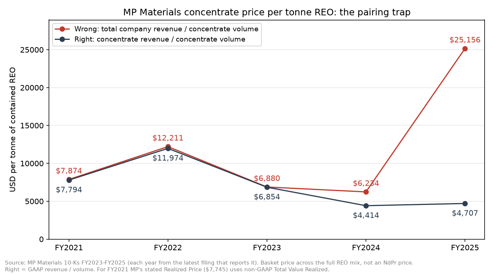

# rare-earth-intel

[](https://github.com/themayankpathak/rare-earth-intel/actions/workflows/tests.yml)

A small, auditable pipeline that reads rare earth companies' annual reports, extracts the numbers
into a structured table where every number keeps its meaning, measures its own accuracy against
checked answers, and catches the mistakes that make naive price calculations wrong.

**Status:** v10, October 2026. Three companies and one government source, twenty-six documents, one label
map per source, 67 unit tests run on every push, and a website with a question box: **[themayankpathak.github.io/rare-earth-intel](https://themayankpathak.github.io/rare-earth-intel/)**

| Source | What it is | Documents | Years covered |
|---|---|---|---|
| MP Materials | US miner and refiner (10-K) | FY2020–FY2025 | FY2019–FY2025 |
| Lynas Rare Earths | Australian miner and separator (Appendix 4E / financial report) | FY2019–FY2026 | FY2013–FY2026 |
| Neo Performance Materials | Canadian processor: magnet powders, chemicals, rare metals (MD&A) | FY2022–FY2025 | FY2020–FY2025 |
| U.S. Geological Survey | Government statistics: Mineral Commodity Summaries, rare earths chapter | 2019–2026 editions | 2014–2025 |

v1 (one MP filing) shipped 30 Sep 2026. Started August 2026. Build log: [`notes/devlog.md`](notes/devlog.md).



## Why this exists

Numbers in company reports are easy to read and easy to misuse. A number only means something
together with its context: which company, which part of it, which product, which year, which unit,
which scale. Take it out of the PDF without that context and it becomes dangerous.

The chart above shows one example. MP Materials reports a price for its rare earth concentrate per
tonne of rare earth content. Divide *total company* revenue by concentrate volume instead, and the
price comes out 0.5% too high in FY2019, 0.5% in FY2020, 1.0% in FY2021, 2.0% in FY2022, 0.4% in
FY2023, then **41% in FY2024 and 435% in FY2025**. For five years the shortcut looks fine. Then the
business changes (MP began refining its own concentrate, then selling magnet materials) and the same
calculation becomes badly wrong, with nothing in the numbers to warn you.

Neo shows the same trap in another form. It reports a consolidated sales volume of 13,216 tonnes for
FY2025. Divide revenue by it and you get about **$36,000 per tonne**, a number that describes nothing
Neo sells: by segment, revenue per tonne is about $19,000 for rare earth chemicals and oxides,
$34,000 for magnet powders and magnets, and **$461,000 for rare metals** such as hafnium. The tonnes
of very different products have been added together.

The government source adds an independent check. USGS publishes US mine production every year, and MP
is the main US producer. MP's own figure falls within USGS's rounding **in every year from 2019 to
2025**: two sources that never see each other's spreadsheets, agreeing. USGS also revises itself:
Australia's 2024 production is 13,000 tonnes in the 2025 edition and 29,000 in the 2026 edition. The
pipeline knows a revised *estimate* is expected; a revised *reported* figure is a question.

This is obvious to an expert who reads the right page, and invisible to a pipeline, a quick
spreadsheet estimate, or an AI tool that doesn't. The project is about making it impossible for a
machine to make it.

These are some of the traps found in the twenty-six documents:

| Trap | Example |
|---|---|
| Wrong pairing | MP: total revenue ÷ concentrate volume (the chart) |
| Tonnes of different things added together | Neo: 13,216 t of chemicals, magnet materials and hafnium; revenue ÷ tonnes = $36k/t, true of no product |
| Tonnes that aren't physical tonnes | MP: 8,922 t is contained rare earth content, not the weight shipped |
| A basket price that isn't an NdPr price | MP $4,707/t and Lynas A$80.7/kg average the whole product mix |
| A unit label that is wrong in the source | Lynas five-year table: "Average selling price (per REO tonne) 80.68" is A$ per **kg** (revenue ÷ volume confirms) |
| Cash that isn't revenue | Lynas prints "Cash receipts from customers A$887.3m" right above "Sales revenue A$977.9m" |
| Revenue that isn't this year's sales | Lynas FY25 revenue includes A$13.8m of price adjustments on earlier, provisionally priced sales |
| Money outside revenue | MP: Price Protection Agreement income ($51.0m) is booked outside revenue |
| Quarter and year side by side | Neo 2024–25 print the quarter first: take the first numbers as the year and FY2025 volume is 2,988 t (Q4), not 13,216 t |
| Quarter columns under a year header | Neo FY2025: `2025 2024` above `Q4 Q3 Q2 Q1 Q4 Q3 Q2 Q1`; read as years, Q3 2025 becomes "FY2024" |
| A header that comes after its rows | Neo FY2024: in the page's text the volume row comes before its own column header |
| A header that looks like data | Lynas: `30 June 2019 30 June 2020 …` on one line starts with a number, so it parses as values |
| Segments that don't add up, by design | Neo: segment volumes are reported before intercompany eliminations, so they exceed the consolidated total |
| Same name, different business | Neo C&O sold two Chinese separation plants in 2025: FY2025 C&O is a smaller business than FY2024 |
| Two scales on one page | MP: "in whole units" and "in thousands" on the same page of the FY2025 10-K |
| Scale inside the label | Lynas: "(A$m)", "($'000)" and "(t)" in the row labels, not in a header |
| Modelled volumes | MP: NdPr sales tonnes convert metal to oxide at an assumed ratio (1.20 in FY2024) |
| Same label, different number | MP: "NdPr oxide and metal" is $115.1m in the revenue table, $9.3m in the related-party note |
| Same heading, different scope | MP: "Total revenue" under "Revenue:" is the whole company in FY2023, one segment in FY2024 |
| Same label, different meaning over time | MP: "Product sales" is the company total in the FY2020 10-K, one product line after "Other sales" was split out |
| A placeholder read as a number | MP FY2024 prints `1,294 200 N/A 1,094`; skip the `N/A` and FY2022 gets 1,094 t, a change figure |
| A stated price that isn't revenue ÷ volume | MP FY2019–FY2021 use non-GAAP "Total Value Realized"; Lynas FY2017, FY2018 and FY2025 don't reconcile (open questions, below) |
| An estimate that was revised | MP: the concentrate's cerium share is 49.1% in the FY2020 10-K, 50.2% from FY2021 |
| Years in a different order | Lynas FY2019 lists `FY16 FY17 FY18 FY19`; later reports newest first; five-year tables oldest first |
| A label split over two lines | Neo FY2023: `Sales volume` on one line, `(tonnes) . . . 12,970` on the next |
| A footnote glued to a number | USGS: "China 11105,000" is footnote 11 + 105,000; Australia's reserves read as 135,700,000 are 5,700,000 + footnote 13 |
| A dash that means zero | USGS legend: "— Zero"; in company reports a dash means no value |
| Codes that hold a column | USGS prints NA, W (withheld), XX, E (net exporter); skip them and later numbers move into the wrong year |
| Estimates revised later | USGS Australia 2024: 13,000 t (2025 edition) → 29,000 t (2026 edition); most production figures are marked "e" |
| A restated price | USGS neodymium oxide 2021: $49/kg in the 2022–23 editions, $98/kg from 2024 (open question, below) |
| A file that isn't what its name says | the downloaded "2021" USGS chapter was byte-for-byte the 2020 edition (same SHA-256) |

## What it does

```
PDF ──► extract_rows.py ──► build_rows.py ──► score.py         (accuracy vs ground truth)
         find tables,         apply label map,  self_checker.py  (checks with no answer key)
         parse lines          28-column rows    plotter.py       (the figure above)
```

Everything company-specific is configuration, not code:

| File | Says |
|---|---|
| [`config/companies.csv`](config/companies.csv) | each source's name, file prefix, year end (31 Dec, or 30 June for Lynas) and reading rules: document type, whether to remove superscripts, whether a dash means zero, how precisely numbers are printed, and which USGS country to compare it with |
| `config/<company>_tables.csv` | where to look: each table and the anchor phrases that find its page |
| `config/<company>_label_map.csv` | what each line means: scope, segment, material, chain stage, metric, basis, unit, and optionally scale, a note, and the entity (each country in the USGS world table) |
| `config/<company>_scope_changes.csv` | optional: when a segment sold or closed a facility, with the page that says so |

1. **Finding the tables.** The extractor searches the whole PDF for each table's anchor. An anchor can
   list older wording to try if the newer is missing (`A | B`), or require two phrases on one page
   (`10.1 Magnequench && Sales volume (tonnes)`, to skip the table of contents). If an anchor matches
   more than one page the run stops instead of guessing. No page numbers in code.
2. **Extraction.** Reads each table line by line and keeps the exact printed text of every number.
   Year columns are read from the table's own header (`2025 2024 2023`, `FY26 FY25`, oldest-first
   `2022 … 2026`, `30 June 2017 30 June 2018 …`). Where quarter and full-year blocks sit side by side,
   the header says which comes first and only the full-year block is taken; change columns are
   skipped; a line of `Q4 Q3 Q2 Q1` labels means no full-year values until the next header. The
   page's header is read before its rows, because a page's text is not always in reading order.
   For USGS, characters printed smaller than the text (footnote numbers, "e" for estimate) are removed
   before reading, so a footnote can never change a number; the "e" marks are kept as estimate flags,
   whether on one value, on a year column, or on a whole table's title.
3. **Meaning.** One label map per company, keyed on table, heading and label, matched ignoring capital
   letters and dot leaders. A map line can name a heading or match the label under any heading (`*`);
   a line that names a heading wins. Guards stop the build if one line gets two meanings or a number
   appears twice in one table.
4. **Context.** Every row carries its source report, PDF page, printed page and `raw_text`. Scope
   changes are added as notes to every affected row: Neo's FY2025 C&O rows say the segment sold two
   plants that year, with the page.
5. **Measured accuracy.** The MP FY2025 output is scored field by field against a 20-row ground truth.
6. **Automatic checks**, with no answer key, on every report:
   raw text found on the cited page; values in a plausible range for their metric and unit;
   revenue ÷ volume agrees with every stated price, allowing for how finely each number is printed;
   segment revenues plus eliminations equal consolidated revenue; segment volumes add up to at least
   the consolidated volume (Neo reports segments before intercompany eliminations); element shares
   add up to 100%; **every number printed in more than one place (another report, another edition, or
   another table of the same report) agrees**, allowing for how finely each copy is printed (USGS
   rounds to significant digits); and **a company's own production agrees with the USGS figure for
   its country** (MP and the United States).

7. **Unit tests** ([`tests/`](tests/)), run by GitHub Actions on every push (the badge above). They use
   real lines from the reports, so they need no PDFs: reading numbers ($, negatives, dashes, N/A, %,
   footnotes, dot leaders, USGS codes), year columns and quarter blocks, page numbers, anchors, small
   sample pages, rounding precision, and the config files themselves (every map line points at a real
   table, no line has two meanings, every metric has a plausible range). Re-introducing three past bugs
   (N/A skipped, the Lynas date header, a map line with two meanings) each fails a named test.

8. **Website** ([`docs/index.html`](docs/index.html), served by GitHub Pages from `docs/`). One page: a
   real report line with a footnote glued to its numbers, the traps, MP against USGS, how it works, the
   open questions, and every number browsable and downloadable with its document and page. It reads
   `docs/data/`, written by [`scripts/build_site.py`](scripts/build_site.py) from the pipeline's output
   (the PDFs are not in the repository). No server: it runs in the browser.

9. **Question box** on the website. A language model (open model on Cloudflare Workers AI, free tier)
   only turns a question into a lookup (who, what, material, part, year); [`worker/worker.js`](worker/worker.js)
   accepts the lookup only if every value exists in the data (`docs/data/vocabulary.json`) and refuses
   everything else: forecasts, advice, companies or metrics or years not in the data. The page then finds
   the figures itself and shows each with its document, page and printed text, plus every other place the
   same figure is printed. Then the model writes a short answer from those figures only (the trend over
   nearby years, revisions between documents, notes, open questions), and a **number guard** checks that
   every number in its text appears in the figures it was given; if one does not, the text is withheld and
   only the cited figures are shown. The guard proves every number came from the data; it cannot prove each
   is attached to the right year, which is why the cited figures always appear under the text.
   The lookup step is measured on 20 questions with known answers, five of which must be refused
   ([`eval/chatbot_questions.csv`](eval/chatbot_questions.csv), [`scripts/evaluate_chatbot.py`](scripts/evaluate_chatbot.py));
   the score is shown on the website.

**Rule:** no language model does arithmetic over retrieved text. Numbers go into the table; the
only division happens in code.

**Rule:** a printed number is never changed. Its meaning goes in the label map (with a note when the
source itself is wrong); a difference that is explained gets its reason and page recorded; a
difference that is not explained stays open.

## Results

| Source | Documents | Rows | Ground truth |
|---|---|---|---|
| MP Materials | 6 | 135 | FY2025: 20 of 20 found, 13 of 13 fields correct on all 20 |
| Lynas Rare Earths | 8 | 290 | none (checks only) |
| Neo Performance Materials | 4 | 116 | none (checks only) |
| U.S. Geological Survey | 8 editions | 336 | none (checks only) |

| Check | Result |
|---|---|
| All automatic checks | **2,041 pass, 0 fail**, 46 expected (explained), 15 open (unexplained) |
| Numbers printed in more than one place | 244: all agree, except MP's revised composition (2, explained), USGS estimates revised by later editions (38, expected) and one restated USGS price (open) |
| MP vs USGS, US production | **7 of 7 years agree** within USGS rounding (2019–2025) |
| Revenue bridges | MP FY2025: 160,369 + 66,861 − 2,789 = 224,441 ($k). Neo: exact in every year FY2020–FY2025 |
| Segment volumes vs consolidated (Neo) | segments exceed consolidated by 40–226 t a year, as expected before eliminations |
| Concentrate composition (MP) | adds up to 100.0% in all six filings |

Each check prints PASS, FAIL, or the status of a recorded exception:

- **EXPECTED** (explained, with the page where the explanation is printed):
  - MP's Realized Price for FY2019–FY2021 is based on non-GAAP "Total Value Realized" (adjusted for
    tariff rebates), so it does not equal GAAP revenue ÷ volume (FY2021 10-K, printed pp.34 and 45).
  - MP's estimated element distribution was revised between the FY2020 10-K (printed p.13) and the
    FY2021 10-K (printed p.26): cerium 49.1% → 50.2%, lanthanum 33.4% → 32.3%.
  - USGS figures marked "e" (estimate) that a later edition revised: expected, as long as the figures
    that are not estimates agree with each other. Anything else is still a failure.
- **OPEN** (a real difference nobody has explained yet; logged, visible, never counted as a pass):
  - **Lynas FY2025**: stated A$50.6/kg against A$50.73/kg from revenue ÷ volume, in two reports and
    two tables. Already ruled out: the revenue note (FY2025 report, printed p.78). Revenue from
    contracts alone gives 49.47; total revenue gives 50.73.
  - **Lynas FY2017 and FY2018**: stated prices about 2% above revenue ÷ volume (18.0 vs 17.58;
    21.6 vs 21.17), in three reports. A lead, unconfirmed: the FY2019 report calls revenue "net sales
    revenue", so the older price may be on gross sales. The FY2017–FY2018 reports are not collected.
  - **Lynas five-year table, FY2019 and FY2022**: two-decimal prices about one cent off
    (18.97 vs 18.98; 60.27 vs 60.28). The one-decimal prices in the sales table reconcile.
  - **USGS neodymium oxide price, 2021**: $49/kg in the 2022 and 2023 editions, $98/kg from the 2024
    edition on, while 2020 is unchanged. The price source footnote changed in the same edition (Argus
    Metals International → Argus Non-Ferrous Metals), but that alone does not explain one restated year.

The open count (15) counts check lines, not questions: there are four open questions, most printed in
several tables or years. Neo states no prices, so it has no price checks; its numbers are guarded by the
bridges, the volume check and cross-checks between reports.

**The checks caught the pipeline's own mistakes.**
- Lynas FY2021–FY2024: the five-year header `30 June 2019 30 June 2020 …` parsed as numbers, so every
  five-year value was filed under the wrong year. Each was plausible alone; five copies of the same
  year's revenue disagreed. Fourteen failures appeared at once; the fix was one line.
- Neo FY2025: the Rare Metals page also holds the start of the quarterly results table, and its
  quarters were read as years. "Revenue" then appeared twice in one table and the build stopped
  instead of saving a wrong number.

**How far each year is cross-checked:**

| | Reported in |
|---|---|
| MP FY2019 | 2 filings (concentrate revenue: 1) |
| MP FY2020–FY2023 | 3 filings each |
| MP FY2024 | 2 filings |
| MP FY2025 | 1 filing, but scored against ground truth |
| Lynas FY2013–FY2015 | 1 report (revenue only, from the FY2020 report's eight-year table) |
| Lynas FY2016 | 2 reports |
| Lynas FY2017 / FY2018 | 3 / 4 reports |
| Lynas FY2019–FY2022 | 5 reports each |
| Lynas FY2023 / FY2024 / FY2025 | 4 / 3 / 2 reports |
| Lynas FY2026 | 1 report |
| Neo FY2020 | 1 MD&A (revenue only) |
| Neo FY2021 | 2 MD&As (volumes: 1) |
| Neo FY2022 / FY2023 | 3 MD&As each |
| Neo FY2024 | 2 MD&As |
| Neo FY2025 | 1 MD&A |
| USGS US production 2014 / 2015 / 2016 / 2017 | 1 / 2 / 3 / 4 editions |
| USGS US production 2018–2021 | 5 editions each |
| USGS US production 2022 / 2023 / 2024 / 2025 | 4 / 3 / 2 / 1 editions |

**Read these honestly.** Values, scales, pages and raw text are extracted independently by code, so
those scores are a real test. The classification fields (basis, chain stage, confidence…) come from
the label map, written with the same judgement as the ground truth; for those, the score shows the
map is applied consistently, not that classification was learned. Lynas, Neo and USGS have no ground
truth; they are guarded by the checks alone.

The checks catch symptoms, not every error. To test them, an earlier `N/A` bug was put back on
purpose: it produces three wrong MP FY2022 values, and the checks flag one of them (a −$19/kg price,
out of range). The other two (1,094 t and 1,132 t) are plausible and have no second source, so they
pass. One red flag would lead a person to the line and to all three, but that is a limit worth
knowing.

## Ground truth

20 rows from the MP FY2025 10-K, chosen to be hard rather than representative: each one targets a
trap. Stored in [`data/ground-truth/`](data/ground-truth/) as an Excel workbook (with live
consistency checks) and a CSV the code reads.

The rows were drafted with AI assistance. Every value was then machine-checked against the text of
its cited page, and the arithmetic reconciliations pass; they have not all been manually reviewed
row by row. Where the extractor and ground truth disagree, the page decides.

## Run it

```bash
pip install -r requirements.txt

for f in FY2025 FY2024 FY2023 FY2022 FY2021 FY2020; do
  python scripts/extract_rows.py mp $f       # PDF -> data/interim/mp_extracted_rows_FYyyyy.csv
  python scripts/build_rows.py mp $f         # + label map -> data/processed/mp_extracted_FYyyyy.csv
done
for f in FY2026 FY2025 FY2024 FY2023 FY2022 FY2021 FY2020 FY2019; do
  python scripts/extract_rows.py lynas $f && python scripts/build_rows.py lynas $f
done
for f in FY2025 FY2024 FY2023 FY2022; do
  python scripts/extract_rows.py neo $f && python scripts/build_rows.py neo $f
done
for e in ED2026 ED2025 ED2024 ED2023 ED2022 ED2021 ED2020 ED2019; do
  python scripts/extract_rows.py usgs $e && python scripts/build_rows.py usgs $e
done
python scripts/score.py                      # MP FY2025 accuracy vs ground truth
python scripts/self_checker.py               # checks on every report, and across reports -> data/interim/checks.csv
python scripts/build_site.py                 # the website's data -> docs/data/
python scripts/plotter.py                    # -> docs/price_trap.png
pytest                                       # unit tests (no PDFs needed)
python -m http.server -d docs                # preview the website at http://localhost:8000
python scripts/evaluate_chatbot.py <worker-url>   # score the question box on 20 test questions
```

The extractor reads every page once to find the tables: under a minute for most reports, about two
minutes each for MP's FY2021, FY2023 and FY2024 PDFs (400+ pages, exhibits included).

**Source documents** (not committed). Save each under `data/raw/` with the name shown and verify with
`sha256sum`. Page references assume these exact files; other copies can paginate differently.

| File | Source | Pages | SHA-256 |
|---|---|---|---|
| `mp-materials_10k_FY2025.pdf` | [0001801368-26-000008](https://www.sec.gov/Archives/edgar/data/1801368/000180136826000008/mp-20251231.htm) | 121 | `c28ed1338d6ff136b8de06ad6ef768613dec44968cb88e4e00db9779b0f104a1` |
| `mp-materials_10k_FY2024.pdf` | [0001801368-25-000009](https://www.sec.gov/Archives/edgar/data/1801368/000180136825000009/mp-20241231.htm) | 444 | `b24f88946900d3153dfe45f9ee6d6c9c964f012f38119d567fe4aa32e5f38445` |
| `mp-materials_10k_FY2023.pdf` | [0001801368-24-000014](https://www.sec.gov/Archives/edgar/data/1801368/000180136824000014/mp-20231231.htm) | 404 | `193ee7039bd9bfe6a7468de0b60ea4e9108971bd56f00917ef1a3c403ae11bb0` |
| `mp-materials_10k_FY2022.pdf` | [0001801368-23-000009](https://www.sec.gov/Archives/edgar/data/1801368/000180136823000009/0001801368-23-000009-index.htm) | 110 | `bfbe5cf67dcbb44e2071f5a799f1e92a98d489763b75e7795ca2d207cc127913` |
| `mp-materials_10k_FY2021.pdf` | [0001801368-22-000010](https://www.sec.gov/Archives/edgar/data/1801368/000180136822000010/0001801368-22-000010-index.htm) | 414 | `938c8cd9471078f4b9e4bfba9e225b3e1aa8bbd46576a333b426d3acda5aa14f` |
| `mp-materials_10k_FY2020.pdf` | [0001801368-21-000011](https://www.sec.gov/Archives/edgar/data/1801368/000180136821000011/0001801368-21-000011-index.html) | 124 | `858be5b31ff450772f073f542d195cfd9dcd62f81d92c4c1f259a1ce254e928e` |
| `lynas_financial_FY2026.pdf` | Lynas Appendix 4E / annual report, year to 30 June 2026 | 141 | `82f9b0ffff029d0581231badaeb5dad662036b4d3987b35fbc965b0e1646303c` |
| `lynas_financial_FY2025.pdf` | same, year to 30 June 2025 | 125 | `15fd5fce3a649ef94fb903d5fb1757639bb36bacf44d92abb0e21d94925c86eb` |
| `lynas_financial_FY2024.pdf` | Consolidated Financial Report, year to 30 June 2024 | 109 | `59f179e3e8864f4c83231ff41a18b4ec3931694ff586b36e27e7a1a1a4462974` |
| `lynas_financial_FY2023.pdf` | same, year to 30 June 2023 | 104 | `490458642fc54e98065b7b2578e68dc1c7430b71b2e301ae95c9367b88fc3fb5` |
| `lynas_financial_FY2022.pdf` | same, incorporating Appendix 4E, year to 30 June 2022 | 102 | `642fed8b4d3b25abf8d07fcf326d06bdb67a9cf2da7b4552c6f2a5d1225b88eb` |
| `lynas_financial_FY2021.pdf` | Appendix 4E, year to 30 June 2021 | 83 | `c7466d4ce5d073e481d738647a4d6e67104d72061e1119791e207c9bba9d2f51` |
| `lynas_financial_FY2020.pdf` | Appendix 4E, year to 30 June 2020 (Lynas Corporation Ltd) | 75 | `6e948130e4f52730b2f28cdf30bf0e219d93d327948104cd4b2b1c48866a9ada` |
| `lynas_financial_FY2019.pdf` | Appendix 4E, year to 30 June 2019 (Lynas Corporation Ltd) | 71 | `f1a46d82d75de601c49cfbc95dbdd3363791777793a4863d4932cde900114616` |
| `neo_mda_FY2025.pdf` | Neo MD&A, year to 31 Dec 2025 (SEDAR+, neomaterials.com) | 34 | `bb6c83f93ecff625a8f25e69b960b40efd88d5ec1c52643d412e33b5f8e778c0` |
| `neo_mda_FY2024.pdf` | same, year to 31 Dec 2024 | 31 | `f5a902931d667bdeb195679ab937976fbb2ed3580438300e818ca2ba01ad1560` |
| `neo_mda_FY2023.pdf` | same, year to 31 Dec 2023 | 54 | `5300fe29623a95a303020529e019e2946b14b0c925e6218516e2687b172d498a` |
| `neo_mda_FY2022.pdf` | same, year to 31 Dec 2022 | 52 | `e4fa9624f321e80f6e62fef1fcbf65d7683cb4e15ff405892ebbf81d33e90908` |
| `usgs_mcs_ED2026.pdf` | USGS Mineral Commodity Summaries 2026, Rare Earths (pubs.usgs.gov) | 2 | `0116a192336fec41c38d8e11dad553bb7703308c1fbd1f97dc14b75c7e7d9900` |
| `usgs_mcs_ED2025.pdf` | same, 2025 edition | 2 | `87e73bd28fd9d87b99a2ea58d104d6e41467e3488c181c61161e0abf22c6c7a1` |
| `usgs_mcs_ED2024.pdf` | same, 2024 edition | 2 | `1cc18fa276ff10cc05fdbe3ece4d003fafec58dd796582b36e7f2adfc15fc06b` |
| `usgs_mcs_ED2023.pdf` | same, 2023 edition | 2 | `090ddc08c971df16abd231b0908819b9563e33a2c7ca661b7d62521fe0011f01` |
| `usgs_mcs_ED2022.pdf` | same, 2022 edition | 2 | `47f04ff41b0693378bcf34c850a97ba1765a8c088ae5ac578caa702d791837db` |
| `usgs_mcs_ED2021.pdf` | same, 2021 edition | 2 | `5a20d7eb502057b63f3dd49d8a97261dbb1057835fc97d296f0df26aeaaa1623` |
| `usgs_mcs_ED2020.pdf` | same, 2020 edition | 2 | `4eaef1e03de767f748093b07fd8ba4d2f4906a18bfb92e83048ae951037844a6` |
| `usgs_mcs_ED2019.pdf` | same, 2019 edition | 2 | `536772cc03112f8434389008e771495717f32ca62b34b06cb0f8094514fd4898` |

Lynas Corporation Ltd became Lynas Rare Earths Ltd between the FY2020 and FY2021 reports (same ACN
009 066 648): one company, one identity in the data. The glossy Lynas annual reports for FY2019–FY2024
contain the same financial report and are kept only for reference. A browser "Print to PDF" copy has
no text layer and different page numbers; this project started with one.

## Known limitations

- Three companies and one government source, all in English. The parser still assumes English labels,
  parentheses for negatives, and that a table's years appear on a header line.
- Only MP is compared with USGS. Lynas is not compared with USGS's Australia figure: Lynas reports
  years to 30 June and the REO in its finished products, USGS reports calendar years and mine output.
- USGS's US production figure includes producers other than Mountain Pass (monazite in the
  southeastern US; Utah compounds per the 2026 edition); the agreement with MP is within rounding.
- USGS's heavy rare earths chapter (2026) is collected but not parsed yet. USGS prices are extracted
  and cross-checked between editions, not compared with company prices (different products and bases).
- The chart covers MP only.
- Neo states no prices, so its numbers have no price check; Neo FY2020 has revenue only.
- MP's composition table is treated as having no period; the FY2020 → FY2021 revision is recorded as
  an exception rather than modelled as a dated estimate.
- Some years come from one report only and cannot be cross-checked (see the table above).
- Scope changes are recorded for Neo only so far. Neo's businesses belonged to Molycorp before 2016;
  pre-2017 figures for the same plants would be a different company.
- A heading carries over until the next heading, so a line can inherit the wrong section name. Map
  lines that need a heading name it explicitly; the rest match under any heading.

## Roadmap

- **A data explorer** (a Streamlit app, built and parked): compare one number across every document.
- **JL Mag** (English Hong Kong reports): volumes are only in sentences, and production switches from
  finished magnets to blanks in 2024; needs a sentence-level extractor. A bridge to Chinese sources.
- **Close the open questions**: the Lynas FY2025 and FY2017–FY2018 price gaps (quarterly reports,
  older annual reports).
- **Older Neo MD&As** (FY2019–FY2021): a second and third source for FY2020–FY2021.
- **Chinese sources**: the schema already carries `language` and `scale_factor` (for 万 and 亿);
  next is a feasibility test on one report and a `parse_quantity(text, lang)` with tests.
- **More cross-source reconciliation**: IEA and trade data; USGS heavy rare earths chapter.
- **Structured data where it exists**: GAAP figures are published by the SEC in machine-readable
  form (XBRL) and could check the parsed values. Operating figures (volumes, realized prices)
  generally are not, which is why the documents are parsed.
- **AI-drafted label maps**: a language model proposes map entries for a new company, a person
  reviews them. Classification, not arithmetic.
- **Question answering with citations**: answer numeric questions from the table, cite the page,
  refuse when the data isn't there.

## Repository layout

```
config/            source list with reading rules; per source: tables (where to look), label map
                   (what it means), scope changes (optional)
data/ground-truth/ 20 checked rows: workbook + CSV (tracked)
data/raw/          source PDFs (ignored; see "Run it")
data/interim/      parser output per report (ignored, regenerated)
data/processed/    28-column rows per report (ignored, regenerated)
docs/              the website (index.html, GitHub Pages), its data (docs/data/) and the chart
notes/             design notes (PROJECT.md), sources, build log
scripts/           the pipeline
worker/            the question box's Cloudflare Worker (pasted into the Cloudflare dashboard)
eval/              20 test questions with known answers for the question box
tests/             unit tests (pytest), run on every push by .github/workflows/tests.yml
```

## About

Built by Mayank Pathak, who works in the NdFeB magnet supply chain. The domain rules, trap
selection and design are his; the Python was written with AI assistance.
